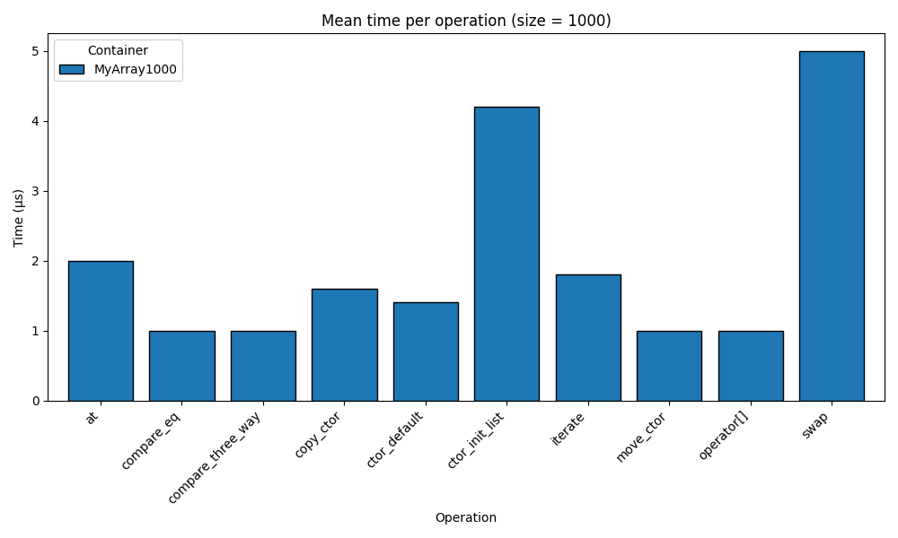
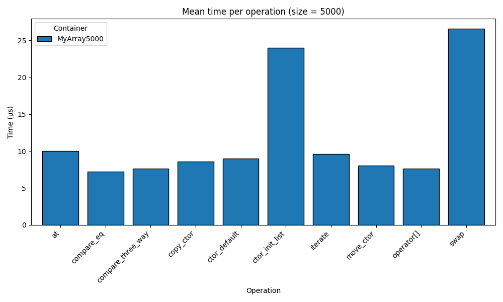
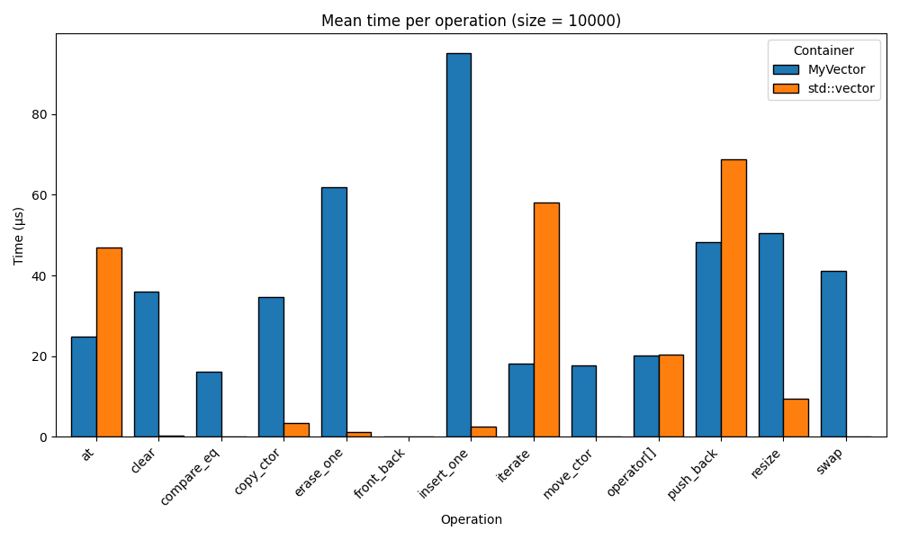
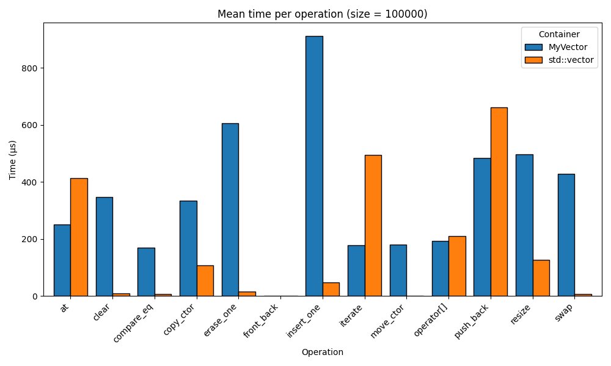

# Lab work 5: Vector
Authors (team):
- Sahaidak Yurii
- Pavlyk Bohdan
- Samoilenko Marta

### Compilation

Using CMakeLists.txt
```bash
mkdir -p build
cd build
cmake ..
cmake --build .
```

### Usage

#### Tests
To using GTests run
```bash
./build/test_my_vector
./build/test_my_array
```

### Results
#### General
- created Google tests for the `MyVector` and `MyArray`
- created classes that conform to the tests
- added git-hub pipeline to run tests, but it waits infinitely =(

#### Valgrind
```bash
valgrind --leak-check=full --show-leak-kinds=all --track-origins=yes ./build/test_my_vector
valgrind --leak-check=full --show-leak-kinds=all --track-origins=yes ./build/test_my_array
```

# Additional tasks
### Comparison




